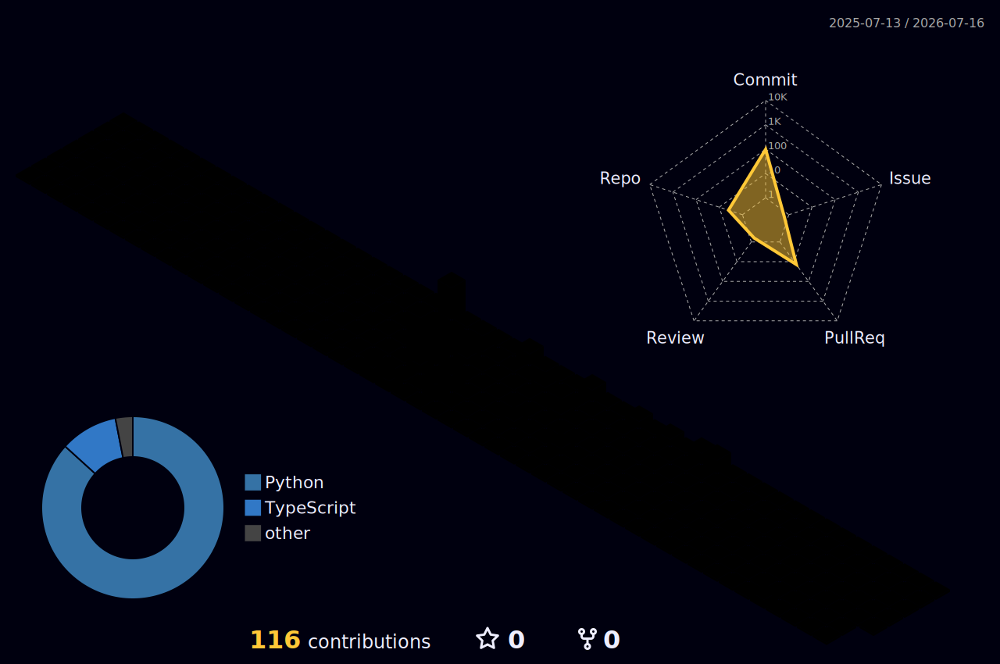

<!-- ANIMATED HEADER -->
<div align="center">
  
</div>

<!-- TYPING ANIMATION -->
<div align="center">

[](https://github.com/TayyabAziz11)

</div>

<!-- STATS BADGES -->
<div align="center">
  
  <a href="https://github.com/TayyabAziz11?tab=followers">
    
  </a>
  
  
</div>


<!-- ABOUT -->
##  About Me

```python
class TayyabAziz:
    def __init__(self):
        self.role     = "AI Systems Engineer"
        self.focus    = ["Voice AI", "Physical AI", "Humanoid Robotics"]
        self.building = "Xyron — a voice-driven AI OS operator"
        self.mindset  = "Build systems that operate, think and learn — not just apps"

    def current_stack(self):
        return ["Python", "FastAPI", "PyTorch", "Next.js", "TypeScript", "Electron"]
```

<table>
<tr><td>

- 🔭 &nbsp;Building **[Xyron](https://github.com/TayyabAziz11/Xyron)** — STT → intent → operator mode → Brain V2
- 🤖 &nbsp;Researching **physical AI & humanoid robotics** (see the textbook repo)
- ⚙️ &nbsp;Full-stack ML: pipelines → FastAPI backends → Electron/Tauri desktop apps
- 🧠 &nbsp;AI agents that use computers like humans: click, type, install, verify
- ⚡ &nbsp;Fun fact: I'd rather automate the computer than touch the mouse

</td></tr>
</table>


<!-- FEATURED PROJECTS -->
##  Featured Projects

<div align="center">

<a href="https://github.com/TayyabAziz11/Xyron">
  
</a>
<a href="https://github.com/TayyabAziz11/physical-ai-humanoid-textbook">
  
</a>
<a href="https://github.com/TayyabAziz11/personal-ai-employee">
  
</a>

</div>

<details>
<summary><b>🧠 &nbsp;Inside Xyron — click to expand the architecture</b></summary>
<br>

> A **voice-driven AI OS operator**. FastAPI backend · Electron/Tauri desktop · Next.js dashboard.

| Layer | What it does |
|-------|--------------|
| 🎙️ **Voice** | Whisper STT (GPU-accelerated) + local TTS · live wake-word detection |
| 🧭 **Routing** | Keyword + semantic intent routing · follow-up context resolver |
| 🖱️ **Operator Mode** | Human-like click / type / navigate automation via PowerShell bridge |
| 🧠 **Brain V2** | Sentinel · Learning · Verifier · Goal engine · Circuit breaker |
| 💗 **Cognition** | Emotional state machine + "introduce yourself" live action demo |
| 💾 **Memory** | Session + long-term facts + episodic SQLite + ChromaDB vector recall |

</details>


<!-- TECH ARSENAL -->
##  Tech Arsenal

<div align="center">

**Languages & AI**


**Backend & Data**


**Frontend & Desktop**


**Tooling**


</div>


<!-- 3D CONTRIBUTION CALENDAR (generated by GitHub Action) -->
##  3D Contribution Calendar

<div align="center">
  
</div>


<!-- GITHUB ANALYTICS -->
##  GitHub Analytics

<div align="center">


</div>

<!-- activity graph -->
<div align="center">
  
</div>

<!-- snake animation (generated by GitHub Action) -->
<div align="center">
  
</div>

<!-- trophies -->
<div align="center">
  
</div>


<!-- CONNECT -->
##  Connect

<div align="center">

[](https://linkedin.com/in/tayyab-aziz-763a502b4)
[](https://instagram.com/ps_tayyab)
[](https://github.com/TayyabAziz11)
[](mailto:muhammadmuneebop935@gmail.com)

</div>

<!-- FOOTER -->
<div align="center">
  
  <br>
  <i>⭐ Thanks for visiting — let's build the future of AI together.</i>
</div>
